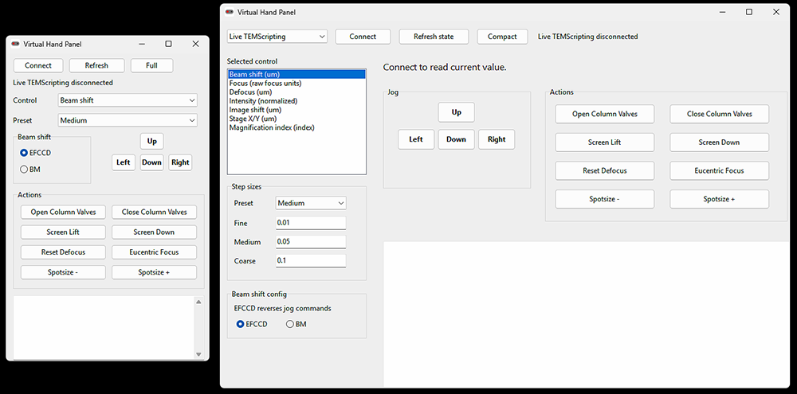

# Hand Panels

Virtual hand-panel software with hotkeys for controlling selected Thermo/FEI TEMScripting microscope functions from a small Delphi VCL application.

The current app is `VirtualHandPanel`, a classic Windows/VCL implementation with two backend modes:

- `Simulator`: runs without microscope access and keeps fake microscope values in memory.
- `Live TEMScripting`: connects through TEMScripting COM APIs on a microscope control machine.

## Screenshots 



## Repository Contents

- `bin/` contains exe already compiled that can be run on microscope PC
- `VirtualHandPanel/`: Delphi source for the virtual hand panel.
- `VENDOR_DEPENDENCIES.md`: notes about external Thermo/FEI TEMScripting files that are required locally but should not be published.

## Safety Notice

Live mode sends commands to microscope optics, stage, camera screen, and related TEMScripting APIs. Review and test changes in simulator mode first, then validate live behavior with an operator who understands the instrument state and local facility procedures.

## Build

1. Install Delphi/RAD Studio on the Windows machine that will build the app.
2. Install or copy the TEMScripting SDK files from the microscope control environment.
3. Place the generated TEMScripting Delphi units at:

   ```text
   ../titan-scripting-SDK/Delphi/Temscripting_TLB.pas
   ../titan-scripting-SDK/Delphi/TemscriptingEvents.pas
   ```

   The path is relative to `VirtualHandPanel/VirtualHandPanel.dpr`.

4. Open `VirtualHandPanel/VirtualHandPanel.dpr` in Delphi/RAD Studio and build.

## Running

Start in `Simulator` mode when testing UI and jog behavior. Switch to `Live TEMScripting` only on a machine where TEMScripting is installed and COM access to the microscope is available.

The detailed control model and hotkeys are documented in `VirtualHandPanel/README.md`.

## License

MIT License
