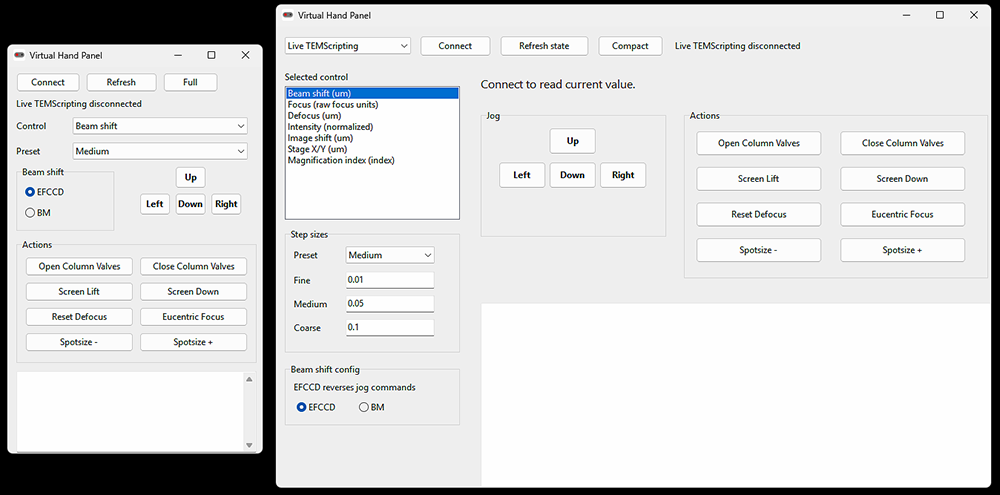

# Hand Panels

Virtual hand-panel software with hotkeys for controlling selected Thermo/FEI TEMScripting microscope functions from a small Delphi VCL application.

The current app is `VirtualHandPanel`, a classic Windows/VCL implementation with two backend modes:

- `Simulator`: runs without microscope access and keeps fake microscope values in memory.
- `Live TEMScripting`: connects through TEMScripting COM APIs on a microscope control machine.

## Screenshots 



## Modes

- `Hand Panel`: the default large view, based on `img/editable/HandPanels.svg`, with
  clickable circular controls integrated into the artwork. Knob halves provide
  minus/plus adjustments, and the top bar selects 1, 5, or 10 MF steps per click.
- `Live TEMScripting`: the default startup mode. Uses `CoInstrument.Create`,
  microscope optics/stage APIs, and user-button event sinks.
- `Compact`: toggled from the top bar. The window shrinks to a focused layout
  with connect/refresh, selected control, selected preset, jog arrows, beam-shift
  configuration, action buttons, Record Search, and the status log. `Full` restores the
  previous window size.
- `Simulator`: launches without microscope access and keeps fake values in memory.

## Record-to-View Stage Search

Record Search helps locate a feature while SerialEM is continuously acquiring with
the Record/Preview preset. Enter the Record pixel size in Angstroms per pixel and,
if needed, change the default K3 dimensions of `5760 x 4092` pixels. The panel
calculates the physical field of view and moves the stage through an outward square
spiral with 25% overlap between neighboring Record views.

The default speed is 10% and the search is limited to +/-10 um from its starting
X/Y position. Each grid move is split into short same-direction submoves so the
Stop button can take effect without waiting for a complete 75%-of-frame move.
TEMScripting cannot abort a submove already in progress; after Stop, that current
submove finishes and the stage remains at the resulting position.

Start SerialEM Preview manually before pressing `Start Search`. Confirm the
calculated geometry, watch for the feature, and press `Stop Search` when it appears.
Full and Compact modes show the same Record Search settings and state.

## Repository Contents

- `bin/` contains exe already compiled that can be run on microscope PC
- `VirtualHandPanel/`: Delphi source for the virtual hand panel.
- `VirtualHandPanel/StageSearchTests.dpr`: console tests for the FOV and square-spiral geometry.
- `VENDOR_DEPENDENCIES.md`: notes about external Thermo/FEI TEMScripting files that are required locally but should not be published.

## Hotkeys

- `← ↑ → ↓` Arrow keys jog the selected control using the fine step.
- `Shift + ← ↑ → ↓` jog the selected control using the coarse step.
- `Shift+1`: fine step.
- `Shift+2`: medium step.
- `Shift+3`: coarse step.

## Running

Download `bin/VirtualHandPanel.exe` to the microscope PC. Start the exe and with `Live TEMScripting` selected (default) press connect button.  Use buttons on program or keyboard hotkeys. 

The detailed control model and hotkeys are documented in `VirtualHandPanel/README.md`.

## Build

1. Install Delphi/RAD Studio on the Windows machine that will build the app.
2. Install or copy the TEMScripting SDK files from the microscope control environment.
3. Place the generated TEMScripting Delphi units at:

   ```text
   ../titan-scripting-SDK/Delphi/Temscripting_TLB.pas
   ../titan-scripting-SDK/Delphi/TemscriptingEvents.pas
   ```

   The path is relative to `VirtualHandPanel/VirtualHandPanel.dpr`.

4. Open `VirtualHandPanel/VirtualHandPanel.dpr` in Delphi/RAD Studio and build.
5. Select the **Win32** target so the microscope's 32-bit `adaFsKnob` COM
   adapter can provide contextual MF-X/MF-Y pulses.

## License

MIT License
